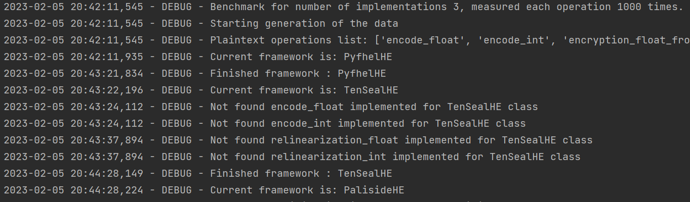
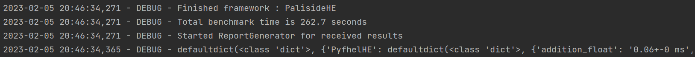
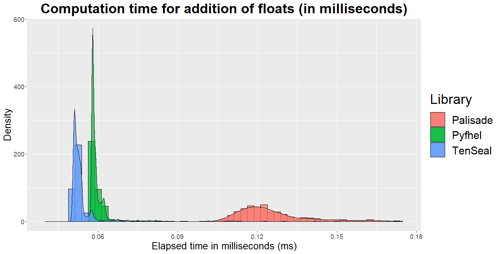
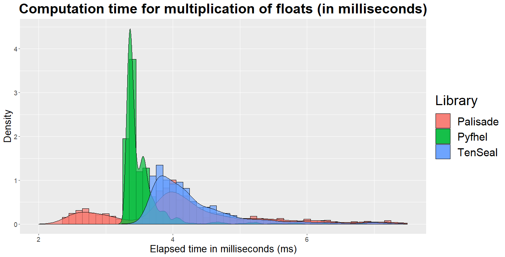

<a name="readme-top"></a>


<!-- PROJECT LOGO -->
<br />
<div align="center">
  <a href="https://github.com/github_username/repo_name">
    
  </a>

<h3 align="center">Homomorphic Encryption CLI</h3>

  <p align="center">
    Universal and extensible benchmarking utility for homomorphic encryption libraries in Python
    <br />
  </p>
</div>


<!-- TABLE OF CONTENTS -->
<details>
  <summary>Table of Contents</summary>
  <ol>
    <li>
      <a href="#about-the-project">About The Project</a>
      <ul>
        <li><a href="#built-with">Built With</a></li>
      </ul>
    </li>
    <li>
      <a href="#getting-started">Getting Started</a>
      <ul>
        <li><a href="#installation">Installation</a></li>
      </ul>
    </li>
    <li><a href="#usage">Usage</a></li>
    <li><a href="#results">Example results</a></li>
    <li><a href="#roadmap">Roadmap</a></li>
    <li><a href="#license">License</a></li>
  </ol>
</details>


<!-- ABOUT THE PROJECT -->

## About The Project

Homomorphic Encryption (HE) is increasing in popularity amongst the encryption and data security community. However,
most libraries are currently implemented in C++, which prevents HE from fully becoming mainstream. Recently, a few
Python libraries for HE have been developed, which should reduce the obstacles of using an encryption technique as
complex as HE. This paper illustrates basic use cases of these Python libraries by implementing a tool that benchmarks
their performance in order to contribute to further disseminating HE. The results of an exemplary benchmarking study
show that two Python HE libraries, namely *Pyfhel* and *TenSEAL*, clearly outperform another Python
HE library named *Palisade* in any kind of operations and should therefore be preferred if performance is an
issue. Even though this paper illustrates that HE libraries are improving in easiness of usability, HE should not be
thought of as a means to solve all data privacy issues once and for all, as its potential also comes hand in hand with a
risk of increasing recklessness with regards to the analysis of personal data.
<p align="right">(<a href="#readme-top">back to top</a>)</p>

### Built With

* 
* 
* 
* 
* 
* [Pyfhel](https://github.com/ibarrond/Pyfhel)
* [TenSeal](https://github.com/OpenMined/TenSEAL)
* [Paliside](https://gitlab.com/palisade/palisade-python-demo)


<p align="right">(<a href="#readme-top">back to top</a>)</p>


<!-- GETTING STARTED -->

## Getting Started

To be able to run benchmark the dependencies should be
installed before the requirements.txt

### Installation

1. Install Pyfhel [repo](https://github.com/ibarrond/Pyfhel)
2. Install TenSeal [repo](https://github.com/OpenMined/TenSEAL)
3. Install PALISADE HOMOMORPHIC ENCRYPTION SOFTWARE LIBRARY [repo](https://gitlab.com/palisade/palisade-python-demo)
4. Goto CLI folder
   ```sh
   git clone https://github.com/differentiator/he_benchmark
   cd he_benchmark/he_benchmarking
   ```
5. Specify parameters for desired Homomorphic encryption configuration in the implementation
6. Specify implementation classes to use with -c parameter
7. Specify number of runs per operation to use with -n parameter
8. Specify how verbosity -v true/yes or false/no to show extra info
9. Specify output directory for the generated results file
9. Example command
   ```sh
   python main.py -n 1000 -c PyfhelHE -c TenSealHE -c PalisideHE -v true -o OUTPUT_DIR
   ```

<p align="right">(<a href="#readme-top">back to top</a>)</p>


<!-- USAGE EXAMPLES -->

## Usage

Project can be used via command line interface with following parameters

```
usage: main.py [-h] [-n NUMBER_OF_RUNS] [-c CLASS_NAME [CLASS_NAME ...]]
               [-o OUTPUT_FOLDER] [-v VERBOSE]

options:
  -h, --help            show this help message and exit
  -n NUMBER_OF_RUNS, --number_of_runs NUMBER_OF_RUNS
                        Number of runs per operation
  -c CLASS_NAME [CLASS_NAME ...], --class_name CLASS_NAME [CLASS_NAME ...]
                        Class name of implemented backends, can be multiple
  -o OUTPUT_FOLDER, --output_folder OUTPUT_FOLDER
                        Output folder to save results
  -v VERBOSE, --verbose VERBOSE
                        Verbosity for logging

Process finished with exit code 0

```

Example usage:

```
python main.py -n 1000 -c PyfhelHE -c TenSealHE -c PalisideHE -v true -o OUTPUT_DIR
```

This will generate detailed log and output as JSON in output folder

<p align="right">(<a href="#readme-top">back to top</a>)</p>

<!-- USAGE EXAMPLES -->

## Example results
<p align="right">(<a href="#results">back to top</a>)</p>

In case of not specifying output directory or verbose true aggregated results will be written to the console



  

Results could be aggregated with different tools, such as R, for example, could be used for the distribution visualization:




<!-- ROADMAP -->

## Roadmap

- [x] CLI arguments parsing
- [x] Data generation
- [x] File output for results (JSON)
- [x] Logging
- [x] Extensible codebase
- [x] Easy to integrate new HE library into benchmark
- [x] Multiple Homomorphic Encryption frameworks supported
    - [x] Paliside
    - [x] Pyfhel
    - [x] TenSeal
    - [ ] Any other framework

<p align="right">(<a href="#readme-top">back to top</a>)</p>


<!-- LICENSE -->

## License

Distributed under the MIT License. See `LICENSE.txt` for more information.

<p align="right">(<a href="#readme-top">back to top</a>)</p>

<!-- MARKDOWN LINKS & IMAGES -->
<!-- https://www.markdownguide.org/basic-syntax/#reference-style-links -->


[pyfhel-url]: https://github.com/ibarrond/Pyfhel


[tenseal-url]: https://github.com/OpenMined/TenSEAL


[paliside-url]: https://gitlab.com/palisade/palisade-python-demo
